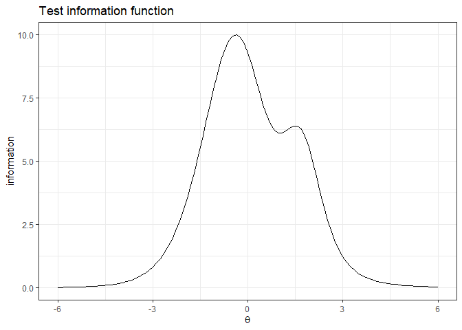

<!-- README.md is generated from README.Rmd. Please edit that file -->

# Welcome to **IRTest**!

*Please feel free to* [create an
issue](https://github.com/SeewooLi/IRTest/issues) *for bug reports or
potential improvements.*

<!-- badges: start -->

[](https://github.com/SeewooLi/IRTest/actions/workflows/R-CMD-check.yaml)
[](https://CRAN.R-project.org/package=IRTest)
[](https://cranlogs.r-pkg.org/badges/grand-total/IRTest)
[](https://app.codecov.io/gh/SeewooLi/IRTest)
<!-- badges: end -->

- **IRTest** is a useful tool for $\mathcal{\color{red}{IRT}}$ (item
  response theory) parameter
  $\mathcal{\color{red}{est}}\textrm{imation}$, especially when the
  violation of normality assumption on latent distribution is suspected.

- **IRTest** deals with uni-dimensional latent variable.

- For missing values, **IRTest** adopts full information maximum
  likelihood (FIML) approach.

- In **IRTest**, including the conventional usage of Gaussian
  distribution, several methods are available for estimation of latent
  distribution:

  - empirical histogram method,
  - two-component Gaussian mixture distribution,
  - Davidian curve,
  - kernel density estimation,  
  - log-linear smoothing.

## Installation

The CRAN version of **IRTest** can be installed on R-console with:

    install.packages("IRTest")

For the development version, it can be installed on R-console with:

    devtools::install_github("SeewooLi/IRTest")

## Functions

Followings are the functions of **IRTest**.

- `IRTest_Dich` is the estimation function when all items are
  *dichotomously* scored.

- `IRTest_Poly` is the estimation function when all items are
  *polytomously* scored.

- `IRTest_Mix` is the estimation function for *a mixed-format test*, a
  test comprising both dichotomous item(s) and polytomous item(s).

- `factor_score` estimates factor scores of examinees.

- `item_fit` tests the statistical fit of all items individually.

- `inform_f_item` calculates the information value(s) of an item.

- `inform_f_test` calculates the information value(s) of a test.

- `plot_item` draws item response function(s) of an item.

- `reliability` calculates marginal reliability coefficient of IRT.

- `latent_distribution` returns evaluated PDF value(s) of an estimated
  latent distribution.

- `DataGeneration` generates several objects that can be useful for
  computer simulation studies. Among these are simulated item
  parameters, ability parameters and the corresponding item-response
  data.

- `dist2` is a probability density function of two-component Gaussian
  mixture distribution.

- `original_par_2GM` converts re-parameterized parameters of
  two-component Gaussian mixture distribution into original parameters.

- `cat_clps` recommends category collapsing based on item parameters
  (or, equivalently, item response functions).

- `recategorize` implements the category collapsing.

## Example

A simple simulation study for a 2PL model can be done in following
manners:

``` r
library(IRTest)
```

- Data generation

An artificial data of 1000 examinees and 20 items.

``` r
Alldata <- DataGeneration(seed = 123456789,
                          model_D = 2,
                          N=1000,
                          nitem_D = 10,
                          latent_dist = "2NM",
                          m=0, # mean of the latent distribution
                          s=1, # s.d. of the latent distribution
                          d = 1.664,
                          sd_ratio = 2,
                          prob = 0.3)

data <- Alldata$data_D
item <- Alldata$item_D
theta <- Alldata$theta
colnames(data) <- paste0("item",1:10)
```

- Analysis

For an illustrative purpose, the two-component Gaussian mixture
distribution (2NM) method is used for the estimation of latent
distribution.

``` r
Mod1 <- 
  IRTest_Dich(
    data = data,
    latent_dist = "2NM"
    )
```

- Summary of the result

``` r
summary(Mod1)
#> Convergence:  
#> Successfully converged below the threshold of 1e-04 on 52nd iterations. 
#> 
#> Model Fit:  
#>  log-likeli   -4786.734 
#>    deviance   9573.469 
#>         AIC   9619.469 
#>         BIC   9732.347 
#>          HQ   9662.37 
#> 
#> The Number of Parameters:  
#>        item   20 
#>        dist   3 
#>       total   23 
#> 
#> The Number of Items:  
#> dichotomous   10 
#> polyotomous   0 
#> 
#> The Estimated Latent Distribution:  
#> method - 2NM 
#> ----------------------------------------
#>                                           
#>                                           
#>                                           
#>                       . @ @ .             
#>           .         . @ @ @ @ .           
#>         @ @ @ . . . @ @ @ @ @ @           
#>       @ @ @ @ @ @ @ @ @ @ @ @ @ @         
#>     . @ @ @ @ @ @ @ @ @ @ @ @ @ @ @       
#>     @ @ @ @ @ @ @ @ @ @ @ @ @ @ @ @ .     
#>   @ @ @ @ @ @ @ @ @ @ @ @ @ @ @ @ @ @ @   
#> +---------+---------+---------+---------+
#> -2        -1        0         1         2
```

- Parameter estimation results

``` r
colnames(item) <- c("a", "b", "c")

knitr::kables(
  list(
    ### True item parameters 
    knitr::kable(item, format='simple', caption = "True item parameters", digits = 2)%>%
  kableExtra::kable_styling(font_size = 4),

    ### Estimated item parameters
    knitr::kable(Mod1$par_est, format='simple', caption = "Estimated item parameters", digits = 2)%>%
  kableExtra::kable_styling(font_size = 4)
  )
)
```

<table class="kable_wrapper">
<tbody>
<tr>
<td>

|    a |     b |   c |
|-----:|------:|----:|
| 2.25 |  0.09 |   0 |
| 1.42 |  0.16 |   0 |
| 2.11 | -1.57 |   0 |
| 1.94 | -1.15 |   0 |
| 1.41 | -1.89 |   0 |
| 2.43 |  0.42 |   0 |
| 2.41 | -1.57 |   0 |
| 2.08 | -0.47 |   0 |
| 1.32 | -0.50 |   0 |
| 1.17 |  0.33 |   0 |

True item parameters

</td>
<td>

|        |    a |     b |   c |
|--------|-----:|------:|----:|
| item1  | 2.15 |  0.12 |   0 |
| item2  | 1.43 |  0.06 |   0 |
| item3  | 2.05 | -1.45 |   0 |
| item4  | 2.07 | -1.03 |   0 |
| item5  | 1.26 | -1.97 |   0 |
| item6  | 2.24 |  0.38 |   0 |
| item7  | 2.21 | -1.68 |   0 |
| item8  | 2.08 | -0.45 |   0 |
| item9  | 1.31 | -0.49 |   0 |
| item10 | 1.06 |  0.41 |   0 |

Estimated item parameters

</td>
</tr>
</tbody>
</table>

``` r


### Plotting
fscores <- factor_score(Mod1, ability_method = "MLE")
#> 
#> MLE for ability parameter estimation, 1/1000MLE for ability parameter
#> estimation, 2/1000MLE for ability parameter estimation, 3/1000MLE for ability
#> parameter estimation, 4/1000MLE for ability parameter estimation, 5/1000MLE for
#> ability parameter estimation, 6/1000MLE for ability parameter estimation,
#> 7/1000MLE for ability parameter estimation, 8/1000MLE for ability parameter
#> estimation, 9/1000MLE for ability parameter estimation, 10/1000MLE for ability
#> parameter estimation, 11/1000MLE for ability parameter estimation, 12/1000MLE
#> for ability parameter estimation, 13/1000MLE for ability parameter estimation,
#> 14/1000MLE for ability parameter estimation, 15/1000MLE for ability parameter
#> estimation, 16/1000MLE for ability parameter estimation, 17/1000MLE for ability
#> parameter estimation, 18/1000MLE for ability parameter estimation, 19/1000MLE
#> for ability parameter estimation, 20/1000MLE for ability parameter estimation,
#> 21/1000MLE for ability parameter estimation, 22/1000MLE for ability parameter
#> estimation, 23/1000MLE for ability parameter estimation, 24/1000MLE for ability
#> parameter estimation, 25/1000MLE for ability parameter estimation, 26/1000MLE
#> for ability parameter estimation, 27/1000MLE for ability parameter estimation,
#> 28/1000MLE for ability parameter estimation, 29/1000MLE for ability parameter
#> estimation, 30/1000MLE for ability parameter estimation, 31/1000MLE for ability
#> parameter estimation, 32/1000MLE for ability parameter estimation, 33/1000MLE
#> for ability parameter estimation, 34/1000MLE for ability parameter estimation,
#> 35/1000MLE for ability parameter estimation, 36/1000MLE for ability parameter
#> estimation, 37/1000MLE for ability parameter estimation, 38/1000MLE for ability
#> parameter estimation, 39/1000MLE for ability parameter estimation, 40/1000MLE
#> for ability parameter estimation, 41/1000MLE for ability parameter estimation,
#> 42/1000MLE for ability parameter estimation, 43/1000MLE for ability parameter
#> estimation, 44/1000MLE for ability parameter estimation, 45/1000MLE for ability
#> parameter estimation, 46/1000MLE for ability parameter estimation, 47/1000MLE
#> for ability parameter estimation, 48/1000MLE for ability parameter estimation,
#> 49/1000MLE for ability parameter estimation, 50/1000MLE for ability parameter
#> estimation, 51/1000MLE for ability parameter estimation, 52/1000MLE for ability
#> parameter estimation, 53/1000MLE for ability parameter estimation, 54/1000MLE
#> for ability parameter estimation, 55/1000MLE for ability parameter estimation,
#> 56/1000MLE for ability parameter estimation, 57/1000MLE for ability parameter
#> estimation, 58/1000MLE for ability parameter estimation, 59/1000MLE for ability
#> parameter estimation, 60/1000MLE for ability parameter estimation, 61/1000MLE
#> for ability parameter estimation, 62/1000MLE for ability parameter estimation,
#> 63/1000MLE for ability parameter estimation, 64/1000MLE for ability parameter
#> estimation, 65/1000MLE for ability parameter estimation, 66/1000MLE for ability
#> parameter estimation, 67/1000MLE for ability parameter estimation, 68/1000MLE
#> for ability parameter estimation, 69/1000MLE for ability parameter estimation,
#> 70/1000MLE for ability parameter estimation, 71/1000MLE for ability parameter
#> estimation, 72/1000MLE for ability parameter estimation, 73/1000MLE for ability
#> parameter estimation, 74/1000MLE for ability parameter estimation, 75/1000MLE
#> for ability parameter estimation, 76/1000MLE for ability parameter estimation,
#> 77/1000MLE for ability parameter estimation, 78/1000MLE for ability parameter
#> estimation, 79/1000MLE for ability parameter estimation, 80/1000MLE for ability
#> parameter estimation, 81/1000MLE for ability parameter estimation, 82/1000MLE
#> for ability parameter estimation, 83/1000MLE for ability parameter estimation,
#> 84/1000MLE for ability parameter estimation, 85/1000MLE for ability parameter
#> estimation, 86/1000MLE for ability parameter estimation, 87/1000MLE for ability
#> parameter estimation, 88/1000MLE for ability parameter estimation, 89/1000MLE
#> for ability parameter estimation, 90/1000MLE for ability parameter estimation,
#> 91/1000MLE for ability parameter estimation, 92/1000MLE for ability parameter
#> estimation, 93/1000MLE for ability parameter estimation, 94/1000MLE for ability
#> parameter estimation, 95/1000MLE for ability parameter estimation, 96/1000MLE
#> for ability parameter estimation, 97/1000MLE for ability parameter estimation,
#> 98/1000MLE for ability parameter estimation, 99/1000MLE for ability parameter
#> estimation, 100/1000MLE for ability parameter estimation, 101/1000MLE for
#> ability parameter estimation, 102/1000MLE for ability parameter estimation,
#> 103/1000MLE for ability parameter estimation, 104/1000MLE for ability parameter
#> estimation, 105/1000MLE for ability parameter estimation, 106/1000MLE for
#> ability parameter estimation, 107/1000MLE for ability parameter estimation,
#> 108/1000MLE for ability parameter estimation, 109/1000MLE for ability parameter
#> estimation, 110/1000MLE for ability parameter estimation, 111/1000MLE for
#> ability parameter estimation, 112/1000MLE for ability parameter estimation,
#> 113/1000MLE for ability parameter estimation, 114/1000MLE for ability parameter
#> estimation, 115/1000MLE for ability parameter estimation, 116/1000MLE for
#> ability parameter estimation, 117/1000MLE for ability parameter estimation,
#> 118/1000MLE for ability parameter estimation, 119/1000MLE for ability parameter
#> estimation, 120/1000MLE for ability parameter estimation, 121/1000MLE for
#> ability parameter estimation, 122/1000MLE for ability parameter estimation,
#> 123/1000MLE for ability parameter estimation, 124/1000MLE for ability parameter
#> estimation, 125/1000MLE for ability parameter estimation, 126/1000MLE for
#> ability parameter estimation, 127/1000MLE for ability parameter estimation,
#> 128/1000MLE for ability parameter estimation, 129/1000MLE for ability parameter
#> estimation, 130/1000MLE for ability parameter estimation, 131/1000MLE for
#> ability parameter estimation, 132/1000MLE for ability parameter estimation,
#> 133/1000MLE for ability parameter estimation, 134/1000MLE for ability parameter
#> estimation, 135/1000MLE for ability parameter estimation, 136/1000MLE for
#> ability parameter estimation, 137/1000MLE for ability parameter estimation,
#> 138/1000MLE for ability parameter estimation, 139/1000MLE for ability parameter
#> estimation, 140/1000MLE for ability parameter estimation, 141/1000MLE for
#> ability parameter estimation, 142/1000MLE for ability parameter estimation,
#> 143/1000MLE for ability parameter estimation, 144/1000MLE for ability parameter
#> estimation, 145/1000MLE for ability parameter estimation, 146/1000MLE for
#> ability parameter estimation, 147/1000MLE for ability parameter estimation,
#> 148/1000MLE for ability parameter estimation, 149/1000MLE for ability parameter
#> estimation, 150/1000MLE for ability parameter estimation, 151/1000MLE for
#> ability parameter estimation, 152/1000MLE for ability parameter estimation,
#> 153/1000MLE for ability parameter estimation, 154/1000MLE for ability parameter
#> estimation, 155/1000MLE for ability parameter estimation, 156/1000MLE for
#> ability parameter estimation, 157/1000MLE for ability parameter estimation,
#> 158/1000MLE for ability parameter estimation, 159/1000MLE for ability parameter
#> estimation, 160/1000MLE for ability parameter estimation, 161/1000MLE for
#> ability parameter estimation, 162/1000MLE for ability parameter estimation,
#> 163/1000MLE for ability parameter estimation, 164/1000MLE for ability parameter
#> estimation, 165/1000MLE for ability parameter estimation, 166/1000MLE for
#> ability parameter estimation, 167/1000MLE for ability parameter estimation,
#> 168/1000MLE for ability parameter estimation, 169/1000MLE for ability parameter
#> estimation, 170/1000MLE for ability parameter estimation, 171/1000MLE for
#> ability parameter estimation, 172/1000MLE for ability parameter estimation,
#> 173/1000MLE for ability parameter estimation, 174/1000MLE for ability parameter
#> estimation, 175/1000MLE for ability parameter estimation, 176/1000MLE for
#> ability parameter estimation, 177/1000MLE for ability parameter estimation,
#> 178/1000MLE for ability parameter estimation, 179/1000MLE for ability parameter
#> estimation, 180/1000MLE for ability parameter estimation, 181/1000MLE for
#> ability parameter estimation, 182/1000MLE for ability parameter estimation,
#> 183/1000MLE for ability parameter estimation, 184/1000MLE for ability parameter
#> estimation, 185/1000MLE for ability parameter estimation, 186/1000MLE for
#> ability parameter estimation, 187/1000MLE for ability parameter estimation,
#> 188/1000MLE for ability parameter estimation, 189/1000MLE for ability parameter
#> estimation, 190/1000MLE for ability parameter estimation, 191/1000MLE for
#> ability parameter estimation, 192/1000MLE for ability parameter estimation,
#> 193/1000MLE for ability parameter estimation, 194/1000MLE for ability parameter
#> estimation, 195/1000MLE for ability parameter estimation, 196/1000MLE for
#> ability parameter estimation, 197/1000MLE for ability parameter estimation,
#> 198/1000MLE for ability parameter estimation, 199/1000MLE for ability parameter
#> estimation, 200/1000MLE for ability parameter estimation, 201/1000MLE for
#> ability parameter estimation, 202/1000MLE for ability parameter estimation,
#> 203/1000MLE for ability parameter estimation, 204/1000MLE for ability parameter
#> estimation, 205/1000MLE for ability parameter estimation, 206/1000MLE for
#> ability parameter estimation, 207/1000MLE for ability parameter estimation,
#> 208/1000MLE for ability parameter estimation, 209/1000MLE for ability parameter
#> estimation, 210/1000MLE for ability parameter estimation, 211/1000MLE for
#> ability parameter estimation, 212/1000MLE for ability parameter estimation,
#> 213/1000MLE for ability parameter estimation, 214/1000MLE for ability parameter
#> estimation, 215/1000MLE for ability parameter estimation, 216/1000MLE for
#> ability parameter estimation, 217/1000MLE for ability parameter estimation,
#> 218/1000MLE for ability parameter estimation, 219/1000MLE for ability parameter
#> estimation, 220/1000MLE for ability parameter estimation, 221/1000MLE for
#> ability parameter estimation, 222/1000MLE for ability parameter estimation,
#> 223/1000MLE for ability parameter estimation, 224/1000MLE for ability parameter
#> estimation, 225/1000MLE for ability parameter estimation, 226/1000MLE for
#> ability parameter estimation, 227/1000MLE for ability parameter estimation,
#> 228/1000MLE for ability parameter estimation, 229/1000MLE for ability parameter
#> estimation, 230/1000MLE for ability parameter estimation, 231/1000MLE for
#> ability parameter estimation, 232/1000MLE for ability parameter estimation,
#> 233/1000MLE for ability parameter estimation, 234/1000MLE for ability parameter
#> estimation, 235/1000MLE for ability parameter estimation, 236/1000MLE for
#> ability parameter estimation, 237/1000MLE for ability parameter estimation,
#> 238/1000MLE for ability parameter estimation, 239/1000MLE for ability parameter
#> estimation, 240/1000MLE for ability parameter estimation, 241/1000MLE for
#> ability parameter estimation, 242/1000MLE for ability parameter estimation,
#> 243/1000MLE for ability parameter estimation, 244/1000MLE for ability parameter
#> estimation, 245/1000MLE for ability parameter estimation, 246/1000MLE for
#> ability parameter estimation, 247/1000MLE for ability parameter estimation,
#> 248/1000MLE for ability parameter estimation, 249/1000MLE for ability parameter
#> estimation, 250/1000MLE for ability parameter estimation, 251/1000MLE for
#> ability parameter estimation, 252/1000MLE for ability parameter estimation,
#> 253/1000MLE for ability parameter estimation, 254/1000MLE for ability parameter
#> estimation, 255/1000MLE for ability parameter estimation, 256/1000MLE for
#> ability parameter estimation, 257/1000MLE for ability parameter estimation,
#> 258/1000MLE for ability parameter estimation, 259/1000MLE for ability parameter
#> estimation, 260/1000MLE for ability parameter estimation, 261/1000MLE for
#> ability parameter estimation, 262/1000MLE for ability parameter estimation,
#> 263/1000MLE for ability parameter estimation, 264/1000MLE for ability parameter
#> estimation, 265/1000MLE for ability parameter estimation, 266/1000MLE for
#> ability parameter estimation, 267/1000MLE for ability parameter estimation,
#> 268/1000MLE for ability parameter estimation, 269/1000MLE for ability parameter
#> estimation, 270/1000MLE for ability parameter estimation, 271/1000MLE for
#> ability parameter estimation, 272/1000MLE for ability parameter estimation,
#> 273/1000MLE for ability parameter estimation, 274/1000MLE for ability parameter
#> estimation, 275/1000MLE for ability parameter estimation, 276/1000MLE for
#> ability parameter estimation, 277/1000MLE for ability parameter estimation,
#> 278/1000MLE for ability parameter estimation, 279/1000MLE for ability parameter
#> estimation, 280/1000MLE for ability parameter estimation, 281/1000MLE for
#> ability parameter estimation, 282/1000MLE for ability parameter estimation,
#> 283/1000MLE for ability parameter estimation, 284/1000MLE for ability parameter
#> estimation, 285/1000MLE for ability parameter estimation, 286/1000MLE for
#> ability parameter estimation, 287/1000MLE for ability parameter estimation,
#> 288/1000MLE for ability parameter estimation, 289/1000MLE for ability parameter
#> estimation, 290/1000MLE for ability parameter estimation, 291/1000MLE for
#> ability parameter estimation, 292/1000MLE for ability parameter estimation,
#> 293/1000MLE for ability parameter estimation, 294/1000MLE for ability parameter
#> estimation, 295/1000MLE for ability parameter estimation, 296/1000MLE for
#> ability parameter estimation, 297/1000MLE for ability parameter estimation,
#> 298/1000MLE for ability parameter estimation, 299/1000MLE for ability parameter
#> estimation, 300/1000MLE for ability parameter estimation, 301/1000MLE for
#> ability parameter estimation, 302/1000MLE for ability parameter estimation,
#> 303/1000MLE for ability parameter estimation, 304/1000MLE for ability parameter
#> estimation, 305/1000MLE for ability parameter estimation, 306/1000MLE for
#> ability parameter estimation, 307/1000MLE for ability parameter estimation,
#> 308/1000MLE for ability parameter estimation, 309/1000MLE for ability parameter
#> estimation, 310/1000MLE for ability parameter estimation, 311/1000MLE for
#> ability parameter estimation, 312/1000MLE for ability parameter estimation,
#> 313/1000MLE for ability parameter estimation, 314/1000MLE for ability parameter
#> estimation, 315/1000MLE for ability parameter estimation, 316/1000MLE for
#> ability parameter estimation, 317/1000MLE for ability parameter estimation,
#> 318/1000MLE for ability parameter estimation, 319/1000MLE for ability parameter
#> estimation, 320/1000MLE for ability parameter estimation, 321/1000MLE for
#> ability parameter estimation, 322/1000MLE for ability parameter estimation,
#> 323/1000MLE for ability parameter estimation, 324/1000MLE for ability parameter
#> estimation, 325/1000MLE for ability parameter estimation, 326/1000MLE for
#> ability parameter estimation, 327/1000MLE for ability parameter estimation,
#> 328/1000MLE for ability parameter estimation, 329/1000MLE for ability parameter
#> estimation, 330/1000MLE for ability parameter estimation, 331/1000MLE for
#> ability parameter estimation, 332/1000MLE for ability parameter estimation,
#> 333/1000MLE for ability parameter estimation, 334/1000MLE for ability parameter
#> estimation, 335/1000MLE for ability parameter estimation, 336/1000MLE for
#> ability parameter estimation, 337/1000MLE for ability parameter estimation,
#> 338/1000MLE for ability parameter estimation, 339/1000MLE for ability parameter
#> estimation, 340/1000MLE for ability parameter estimation, 341/1000MLE for
#> ability parameter estimation, 342/1000MLE for ability parameter estimation,
#> 343/1000MLE for ability parameter estimation, 344/1000MLE for ability parameter
#> estimation, 345/1000MLE for ability parameter estimation, 346/1000MLE for
#> ability parameter estimation, 347/1000MLE for ability parameter estimation,
#> 348/1000MLE for ability parameter estimation, 349/1000MLE for ability parameter
#> estimation, 350/1000MLE for ability parameter estimation, 351/1000MLE for
#> ability parameter estimation, 352/1000MLE for ability parameter estimation,
#> 353/1000MLE for ability parameter estimation, 354/1000MLE for ability parameter
#> estimation, 355/1000MLE for ability parameter estimation, 356/1000MLE for
#> ability parameter estimation, 357/1000MLE for ability parameter estimation,
#> 358/1000MLE for ability parameter estimation, 359/1000MLE for ability parameter
#> estimation, 360/1000MLE for ability parameter estimation, 361/1000MLE for
#> ability parameter estimation, 362/1000MLE for ability parameter estimation,
#> 363/1000MLE for ability parameter estimation, 364/1000MLE for ability parameter
#> estimation, 365/1000MLE for ability parameter estimation, 366/1000MLE for
#> ability parameter estimation, 367/1000MLE for ability parameter estimation,
#> 368/1000MLE for ability parameter estimation, 369/1000MLE for ability parameter
#> estimation, 370/1000MLE for ability parameter estimation, 371/1000MLE for
#> ability parameter estimation, 372/1000MLE for ability parameter estimation,
#> 373/1000MLE for ability parameter estimation, 374/1000MLE for ability parameter
#> estimation, 375/1000MLE for ability parameter estimation, 376/1000MLE for
#> ability parameter estimation, 377/1000MLE for ability parameter estimation,
#> 378/1000MLE for ability parameter estimation, 379/1000MLE for ability parameter
#> estimation, 380/1000MLE for ability parameter estimation, 381/1000MLE for
#> ability parameter estimation, 382/1000MLE for ability parameter estimation,
#> 383/1000MLE for ability parameter estimation, 384/1000MLE for ability parameter
#> estimation, 385/1000MLE for ability parameter estimation, 386/1000MLE for
#> ability parameter estimation, 387/1000MLE for ability parameter estimation,
#> 388/1000MLE for ability parameter estimation, 389/1000MLE for ability parameter
#> estimation, 390/1000MLE for ability parameter estimation, 391/1000MLE for
#> ability parameter estimation, 392/1000MLE for ability parameter estimation,
#> 393/1000MLE for ability parameter estimation, 394/1000MLE for ability parameter
#> estimation, 395/1000MLE for ability parameter estimation, 396/1000MLE for
#> ability parameter estimation, 397/1000MLE for ability parameter estimation,
#> 398/1000MLE for ability parameter estimation, 399/1000MLE for ability parameter
#> estimation, 400/1000MLE for ability parameter estimation, 401/1000MLE for
#> ability parameter estimation, 402/1000MLE for ability parameter estimation,
#> 403/1000MLE for ability parameter estimation, 404/1000MLE for ability parameter
#> estimation, 405/1000MLE for ability parameter estimation, 406/1000MLE for
#> ability parameter estimation, 407/1000MLE for ability parameter estimation,
#> 408/1000MLE for ability parameter estimation, 409/1000MLE for ability parameter
#> estimation, 410/1000MLE for ability parameter estimation, 411/1000MLE for
#> ability parameter estimation, 412/1000MLE for ability parameter estimation,
#> 413/1000MLE for ability parameter estimation, 414/1000MLE for ability parameter
#> estimation, 415/1000MLE for ability parameter estimation, 416/1000MLE for
#> ability parameter estimation, 417/1000MLE for ability parameter estimation,
#> 418/1000MLE for ability parameter estimation, 419/1000MLE for ability parameter
#> estimation, 420/1000MLE for ability parameter estimation, 421/1000MLE for
#> ability parameter estimation, 422/1000MLE for ability parameter estimation,
#> 423/1000MLE for ability parameter estimation, 424/1000MLE for ability parameter
#> estimation, 425/1000MLE for ability parameter estimation, 426/1000MLE for
#> ability parameter estimation, 427/1000MLE for ability parameter estimation,
#> 428/1000MLE for ability parameter estimation, 429/1000MLE for ability parameter
#> estimation, 430/1000MLE for ability parameter estimation, 431/1000MLE for
#> ability parameter estimation, 432/1000MLE for ability parameter estimation,
#> 433/1000MLE for ability parameter estimation, 434/1000MLE for ability parameter
#> estimation, 435/1000MLE for ability parameter estimation, 436/1000MLE for
#> ability parameter estimation, 437/1000MLE for ability parameter estimation,
#> 438/1000MLE for ability parameter estimation, 439/1000MLE for ability parameter
#> estimation, 440/1000MLE for ability parameter estimation, 441/1000MLE for
#> ability parameter estimation, 442/1000MLE for ability parameter estimation,
#> 443/1000MLE for ability parameter estimation, 444/1000MLE for ability parameter
#> estimation, 445/1000MLE for ability parameter estimation, 446/1000MLE for
#> ability parameter estimation, 447/1000MLE for ability parameter estimation,
#> 448/1000MLE for ability parameter estimation, 449/1000MLE for ability parameter
#> estimation, 450/1000MLE for ability parameter estimation, 451/1000MLE for
#> ability parameter estimation, 452/1000MLE for ability parameter estimation,
#> 453/1000MLE for ability parameter estimation, 454/1000MLE for ability parameter
#> estimation, 455/1000MLE for ability parameter estimation, 456/1000MLE for
#> ability parameter estimation, 457/1000MLE for ability parameter estimation,
#> 458/1000MLE for ability parameter estimation, 459/1000MLE for ability parameter
#> estimation, 460/1000MLE for ability parameter estimation, 461/1000MLE for
#> ability parameter estimation, 462/1000MLE for ability parameter estimation,
#> 463/1000MLE for ability parameter estimation, 464/1000MLE for ability parameter
#> estimation, 465/1000MLE for ability parameter estimation, 466/1000MLE for
#> ability parameter estimation, 467/1000MLE for ability parameter estimation,
#> 468/1000MLE for ability parameter estimation, 469/1000MLE for ability parameter
#> estimation, 470/1000MLE for ability parameter estimation, 471/1000MLE for
#> ability parameter estimation, 472/1000MLE for ability parameter estimation,
#> 473/1000MLE for ability parameter estimation, 474/1000MLE for ability parameter
#> estimation, 475/1000MLE for ability parameter estimation, 476/1000MLE for
#> ability parameter estimation, 477/1000MLE for ability parameter estimation,
#> 478/1000MLE for ability parameter estimation, 479/1000MLE for ability parameter
#> estimation, 480/1000MLE for ability parameter estimation, 481/1000MLE for
#> ability parameter estimation, 482/1000MLE for ability parameter estimation,
#> 483/1000MLE for ability parameter estimation, 484/1000MLE for ability parameter
#> estimation, 485/1000MLE for ability parameter estimation, 486/1000MLE for
#> ability parameter estimation, 487/1000MLE for ability parameter estimation,
#> 488/1000MLE for ability parameter estimation, 489/1000MLE for ability parameter
#> estimation, 490/1000MLE for ability parameter estimation, 491/1000MLE for
#> ability parameter estimation, 492/1000MLE for ability parameter estimation,
#> 493/1000MLE for ability parameter estimation, 494/1000MLE for ability parameter
#> estimation, 495/1000MLE for ability parameter estimation, 496/1000MLE for
#> ability parameter estimation, 497/1000MLE for ability parameter estimation,
#> 498/1000MLE for ability parameter estimation, 499/1000MLE for ability parameter
#> estimation, 500/1000MLE for ability parameter estimation, 501/1000MLE for
#> ability parameter estimation, 502/1000MLE for ability parameter estimation,
#> 503/1000MLE for ability parameter estimation, 504/1000MLE for ability parameter
#> estimation, 505/1000MLE for ability parameter estimation, 506/1000MLE for
#> ability parameter estimation, 507/1000MLE for ability parameter estimation,
#> 508/1000MLE for ability parameter estimation, 509/1000MLE for ability parameter
#> estimation, 510/1000MLE for ability parameter estimation, 511/1000MLE for
#> ability parameter estimation, 512/1000MLE for ability parameter estimation,
#> 513/1000MLE for ability parameter estimation, 514/1000MLE for ability parameter
#> estimation, 515/1000MLE for ability parameter estimation, 516/1000MLE for
#> ability parameter estimation, 517/1000MLE for ability parameter estimation,
#> 518/1000MLE for ability parameter estimation, 519/1000MLE for ability parameter
#> estimation, 520/1000MLE for ability parameter estimation, 521/1000MLE for
#> ability parameter estimation, 522/1000MLE for ability parameter estimation,
#> 523/1000MLE for ability parameter estimation, 524/1000MLE for ability parameter
#> estimation, 525/1000MLE for ability parameter estimation, 526/1000MLE for
#> ability parameter estimation, 527/1000MLE for ability parameter estimation,
#> 528/1000MLE for ability parameter estimation, 529/1000MLE for ability parameter
#> estimation, 530/1000MLE for ability parameter estimation, 531/1000MLE for
#> ability parameter estimation, 532/1000MLE for ability parameter estimation,
#> 533/1000MLE for ability parameter estimation, 534/1000MLE for ability parameter
#> estimation, 535/1000MLE for ability parameter estimation, 536/1000MLE for
#> ability parameter estimation, 537/1000MLE for ability parameter estimation,
#> 538/1000MLE for ability parameter estimation, 539/1000MLE for ability parameter
#> estimation, 540/1000MLE for ability parameter estimation, 541/1000MLE for
#> ability parameter estimation, 542/1000MLE for ability parameter estimation,
#> 543/1000MLE for ability parameter estimation, 544/1000MLE for ability parameter
#> estimation, 545/1000MLE for ability parameter estimation, 546/1000MLE for
#> ability parameter estimation, 547/1000MLE for ability parameter estimation,
#> 548/1000MLE for ability parameter estimation, 549/1000MLE for ability parameter
#> estimation, 550/1000MLE for ability parameter estimation, 551/1000MLE for
#> ability parameter estimation, 552/1000MLE for ability parameter estimation,
#> 553/1000MLE for ability parameter estimation, 554/1000MLE for ability parameter
#> estimation, 555/1000MLE for ability parameter estimation, 556/1000MLE for
#> ability parameter estimation, 557/1000MLE for ability parameter estimation,
#> 558/1000MLE for ability parameter estimation, 559/1000MLE for ability parameter
#> estimation, 560/1000MLE for ability parameter estimation, 561/1000MLE for
#> ability parameter estimation, 562/1000MLE for ability parameter estimation,
#> 563/1000MLE for ability parameter estimation, 564/1000MLE for ability parameter
#> estimation, 565/1000MLE for ability parameter estimation, 566/1000MLE for
#> ability parameter estimation, 567/1000MLE for ability parameter estimation,
#> 568/1000MLE for ability parameter estimation, 569/1000MLE for ability parameter
#> estimation, 570/1000MLE for ability parameter estimation, 571/1000MLE for
#> ability parameter estimation, 572/1000MLE for ability parameter estimation,
#> 573/1000MLE for ability parameter estimation, 574/1000MLE for ability parameter
#> estimation, 575/1000MLE for ability parameter estimation, 576/1000MLE for
#> ability parameter estimation, 577/1000MLE for ability parameter estimation,
#> 578/1000MLE for ability parameter estimation, 579/1000MLE for ability parameter
#> estimation, 580/1000MLE for ability parameter estimation, 581/1000MLE for
#> ability parameter estimation, 582/1000MLE for ability parameter estimation,
#> 583/1000MLE for ability parameter estimation, 584/1000MLE for ability parameter
#> estimation, 585/1000MLE for ability parameter estimation, 586/1000MLE for
#> ability parameter estimation, 587/1000MLE for ability parameter estimation,
#> 588/1000MLE for ability parameter estimation, 589/1000MLE for ability parameter
#> estimation, 590/1000MLE for ability parameter estimation, 591/1000MLE for
#> ability parameter estimation, 592/1000MLE for ability parameter estimation,
#> 593/1000MLE for ability parameter estimation, 594/1000MLE for ability parameter
#> estimation, 595/1000MLE for ability parameter estimation, 596/1000MLE for
#> ability parameter estimation, 597/1000MLE for ability parameter estimation,
#> 598/1000MLE for ability parameter estimation, 599/1000MLE for ability parameter
#> estimation, 600/1000MLE for ability parameter estimation, 601/1000MLE for
#> ability parameter estimation, 602/1000MLE for ability parameter estimation,
#> 603/1000MLE for ability parameter estimation, 604/1000MLE for ability parameter
#> estimation, 605/1000MLE for ability parameter estimation, 606/1000MLE for
#> ability parameter estimation, 607/1000MLE for ability parameter estimation,
#> 608/1000MLE for ability parameter estimation, 609/1000MLE for ability parameter
#> estimation, 610/1000MLE for ability parameter estimation, 611/1000MLE for
#> ability parameter estimation, 612/1000MLE for ability parameter estimation,
#> 613/1000MLE for ability parameter estimation, 614/1000MLE for ability parameter
#> estimation, 615/1000MLE for ability parameter estimation, 616/1000MLE for
#> ability parameter estimation, 617/1000MLE for ability parameter estimation,
#> 618/1000MLE for ability parameter estimation, 619/1000MLE for ability parameter
#> estimation, 620/1000MLE for ability parameter estimation, 621/1000MLE for
#> ability parameter estimation, 622/1000MLE for ability parameter estimation,
#> 623/1000MLE for ability parameter estimation, 624/1000MLE for ability parameter
#> estimation, 625/1000MLE for ability parameter estimation, 626/1000MLE for
#> ability parameter estimation, 627/1000MLE for ability parameter estimation,
#> 628/1000MLE for ability parameter estimation, 629/1000MLE for ability parameter
#> estimation, 630/1000MLE for ability parameter estimation, 631/1000MLE for
#> ability parameter estimation, 632/1000MLE for ability parameter estimation,
#> 633/1000MLE for ability parameter estimation, 634/1000MLE for ability parameter
#> estimation, 635/1000MLE for ability parameter estimation, 636/1000MLE for
#> ability parameter estimation, 637/1000MLE for ability parameter estimation,
#> 638/1000MLE for ability parameter estimation, 639/1000MLE for ability parameter
#> estimation, 640/1000MLE for ability parameter estimation, 641/1000MLE for
#> ability parameter estimation, 642/1000MLE for ability parameter estimation,
#> 643/1000MLE for ability parameter estimation, 644/1000MLE for ability parameter
#> estimation, 645/1000MLE for ability parameter estimation, 646/1000MLE for
#> ability parameter estimation, 647/1000MLE for ability parameter estimation,
#> 648/1000MLE for ability parameter estimation, 649/1000MLE for ability parameter
#> estimation, 650/1000MLE for ability parameter estimation, 651/1000MLE for
#> ability parameter estimation, 652/1000MLE for ability parameter estimation,
#> 653/1000MLE for ability parameter estimation, 654/1000MLE for ability parameter
#> estimation, 655/1000MLE for ability parameter estimation, 656/1000MLE for
#> ability parameter estimation, 657/1000MLE for ability parameter estimation,
#> 658/1000MLE for ability parameter estimation, 659/1000MLE for ability parameter
#> estimation, 660/1000MLE for ability parameter estimation, 661/1000MLE for
#> ability parameter estimation, 662/1000MLE for ability parameter estimation,
#> 663/1000MLE for ability parameter estimation, 664/1000MLE for ability parameter
#> estimation, 665/1000MLE for ability parameter estimation, 666/1000MLE for
#> ability parameter estimation, 667/1000MLE for ability parameter estimation,
#> 668/1000MLE for ability parameter estimation, 669/1000MLE for ability parameter
#> estimation, 670/1000MLE for ability parameter estimation, 671/1000MLE for
#> ability parameter estimation, 672/1000MLE for ability parameter estimation,
#> 673/1000MLE for ability parameter estimation, 674/1000MLE for ability parameter
#> estimation, 675/1000MLE for ability parameter estimation, 676/1000MLE for
#> ability parameter estimation, 677/1000MLE for ability parameter estimation,
#> 678/1000MLE for ability parameter estimation, 679/1000MLE for ability parameter
#> estimation, 680/1000MLE for ability parameter estimation, 681/1000MLE for
#> ability parameter estimation, 682/1000MLE for ability parameter estimation,
#> 683/1000MLE for ability parameter estimation, 684/1000MLE for ability parameter
#> estimation, 685/1000MLE for ability parameter estimation, 686/1000MLE for
#> ability parameter estimation, 687/1000MLE for ability parameter estimation,
#> 688/1000MLE for ability parameter estimation, 689/1000MLE for ability parameter
#> estimation, 690/1000MLE for ability parameter estimation, 691/1000MLE for
#> ability parameter estimation, 692/1000MLE for ability parameter estimation,
#> 693/1000MLE for ability parameter estimation, 694/1000MLE for ability parameter
#> estimation, 695/1000MLE for ability parameter estimation, 696/1000MLE for
#> ability parameter estimation, 697/1000MLE for ability parameter estimation,
#> 698/1000MLE for ability parameter estimation, 699/1000MLE for ability parameter
#> estimation, 700/1000MLE for ability parameter estimation, 701/1000MLE for
#> ability parameter estimation, 702/1000MLE for ability parameter estimation,
#> 703/1000MLE for ability parameter estimation, 704/1000MLE for ability parameter
#> estimation, 705/1000MLE for ability parameter estimation, 706/1000MLE for
#> ability parameter estimation, 707/1000MLE for ability parameter estimation,
#> 708/1000MLE for ability parameter estimation, 709/1000MLE for ability parameter
#> estimation, 710/1000MLE for ability parameter estimation, 711/1000MLE for
#> ability parameter estimation, 712/1000MLE for ability parameter estimation,
#> 713/1000MLE for ability parameter estimation, 714/1000MLE for ability parameter
#> estimation, 715/1000MLE for ability parameter estimation, 716/1000MLE for
#> ability parameter estimation, 717/1000MLE for ability parameter estimation,
#> 718/1000MLE for ability parameter estimation, 719/1000MLE for ability parameter
#> estimation, 720/1000MLE for ability parameter estimation, 721/1000MLE for
#> ability parameter estimation, 722/1000MLE for ability parameter estimation,
#> 723/1000MLE for ability parameter estimation, 724/1000MLE for ability parameter
#> estimation, 725/1000MLE for ability parameter estimation, 726/1000MLE for
#> ability parameter estimation, 727/1000MLE for ability parameter estimation,
#> 728/1000MLE for ability parameter estimation, 729/1000MLE for ability parameter
#> estimation, 730/1000MLE for ability parameter estimation, 731/1000MLE for
#> ability parameter estimation, 732/1000MLE for ability parameter estimation,
#> 733/1000MLE for ability parameter estimation, 734/1000MLE for ability parameter
#> estimation, 735/1000MLE for ability parameter estimation, 736/1000MLE for
#> ability parameter estimation, 737/1000MLE for ability parameter estimation,
#> 738/1000MLE for ability parameter estimation, 739/1000MLE for ability parameter
#> estimation, 740/1000MLE for ability parameter estimation, 741/1000MLE for
#> ability parameter estimation, 742/1000MLE for ability parameter estimation,
#> 743/1000MLE for ability parameter estimation, 744/1000MLE for ability parameter
#> estimation, 745/1000MLE for ability parameter estimation, 746/1000MLE for
#> ability parameter estimation, 747/1000MLE for ability parameter estimation,
#> 748/1000MLE for ability parameter estimation, 749/1000MLE for ability parameter
#> estimation, 750/1000MLE for ability parameter estimation, 751/1000MLE for
#> ability parameter estimation, 752/1000MLE for ability parameter estimation,
#> 753/1000MLE for ability parameter estimation, 754/1000MLE for ability parameter
#> estimation, 755/1000MLE for ability parameter estimation, 756/1000MLE for
#> ability parameter estimation, 757/1000MLE for ability parameter estimation,
#> 758/1000MLE for ability parameter estimation, 759/1000MLE for ability parameter
#> estimation, 760/1000MLE for ability parameter estimation, 761/1000MLE for
#> ability parameter estimation, 762/1000MLE for ability parameter estimation,
#> 763/1000MLE for ability parameter estimation, 764/1000MLE for ability parameter
#> estimation, 765/1000MLE for ability parameter estimation, 766/1000MLE for
#> ability parameter estimation, 767/1000MLE for ability parameter estimation,
#> 768/1000MLE for ability parameter estimation, 769/1000MLE for ability parameter
#> estimation, 770/1000MLE for ability parameter estimation, 771/1000MLE for
#> ability parameter estimation, 772/1000MLE for ability parameter estimation,
#> 773/1000MLE for ability parameter estimation, 774/1000MLE for ability parameter
#> estimation, 775/1000MLE for ability parameter estimation, 776/1000MLE for
#> ability parameter estimation, 777/1000MLE for ability parameter estimation,
#> 778/1000MLE for ability parameter estimation, 779/1000MLE for ability parameter
#> estimation, 780/1000MLE for ability parameter estimation, 781/1000MLE for
#> ability parameter estimation, 782/1000MLE for ability parameter estimation,
#> 783/1000MLE for ability parameter estimation, 784/1000MLE for ability parameter
#> estimation, 785/1000MLE for ability parameter estimation, 786/1000MLE for
#> ability parameter estimation, 787/1000MLE for ability parameter estimation,
#> 788/1000MLE for ability parameter estimation, 789/1000MLE for ability parameter
#> estimation, 790/1000MLE for ability parameter estimation, 791/1000MLE for
#> ability parameter estimation, 792/1000MLE for ability parameter estimation,
#> 793/1000MLE for ability parameter estimation, 794/1000MLE for ability parameter
#> estimation, 795/1000MLE for ability parameter estimation, 796/1000MLE for
#> ability parameter estimation, 797/1000MLE for ability parameter estimation,
#> 798/1000MLE for ability parameter estimation, 799/1000MLE for ability parameter
#> estimation, 800/1000MLE for ability parameter estimation, 801/1000MLE for
#> ability parameter estimation, 802/1000MLE for ability parameter estimation,
#> 803/1000MLE for ability parameter estimation, 804/1000MLE for ability parameter
#> estimation, 805/1000MLE for ability parameter estimation, 806/1000MLE for
#> ability parameter estimation, 807/1000MLE for ability parameter estimation,
#> 808/1000MLE for ability parameter estimation, 809/1000MLE for ability parameter
#> estimation, 810/1000MLE for ability parameter estimation, 811/1000MLE for
#> ability parameter estimation, 812/1000MLE for ability parameter estimation,
#> 813/1000MLE for ability parameter estimation, 814/1000MLE for ability parameter
#> estimation, 815/1000MLE for ability parameter estimation, 816/1000MLE for
#> ability parameter estimation, 817/1000MLE for ability parameter estimation,
#> 818/1000MLE for ability parameter estimation, 819/1000MLE for ability parameter
#> estimation, 820/1000MLE for ability parameter estimation, 821/1000MLE for
#> ability parameter estimation, 822/1000MLE for ability parameter estimation,
#> 823/1000MLE for ability parameter estimation, 824/1000MLE for ability parameter
#> estimation, 825/1000MLE for ability parameter estimation, 826/1000MLE for
#> ability parameter estimation, 827/1000MLE for ability parameter estimation,
#> 828/1000MLE for ability parameter estimation, 829/1000MLE for ability parameter
#> estimation, 830/1000MLE for ability parameter estimation, 831/1000MLE for
#> ability parameter estimation, 832/1000MLE for ability parameter estimation,
#> 833/1000MLE for ability parameter estimation, 834/1000MLE for ability parameter
#> estimation, 835/1000MLE for ability parameter estimation, 836/1000MLE for
#> ability parameter estimation, 837/1000MLE for ability parameter estimation,
#> 838/1000MLE for ability parameter estimation, 839/1000MLE for ability parameter
#> estimation, 840/1000MLE for ability parameter estimation, 841/1000MLE for
#> ability parameter estimation, 842/1000MLE for ability parameter estimation,
#> 843/1000MLE for ability parameter estimation, 844/1000MLE for ability parameter
#> estimation, 845/1000MLE for ability parameter estimation, 846/1000MLE for
#> ability parameter estimation, 847/1000MLE for ability parameter estimation,
#> 848/1000MLE for ability parameter estimation, 849/1000MLE for ability parameter
#> estimation, 850/1000MLE for ability parameter estimation, 851/1000MLE for
#> ability parameter estimation, 852/1000MLE for ability parameter estimation,
#> 853/1000MLE for ability parameter estimation, 854/1000MLE for ability parameter
#> estimation, 855/1000MLE for ability parameter estimation, 856/1000MLE for
#> ability parameter estimation, 857/1000MLE for ability parameter estimation,
#> 858/1000MLE for ability parameter estimation, 859/1000MLE for ability parameter
#> estimation, 860/1000MLE for ability parameter estimation, 861/1000MLE for
#> ability parameter estimation, 862/1000MLE for ability parameter estimation,
#> 863/1000MLE for ability parameter estimation, 864/1000MLE for ability parameter
#> estimation, 865/1000MLE for ability parameter estimation, 866/1000MLE for
#> ability parameter estimation, 867/1000MLE for ability parameter estimation,
#> 868/1000MLE for ability parameter estimation, 869/1000MLE for ability parameter
#> estimation, 870/1000MLE for ability parameter estimation, 871/1000MLE for
#> ability parameter estimation, 872/1000MLE for ability parameter estimation,
#> 873/1000MLE for ability parameter estimation, 874/1000MLE for ability parameter
#> estimation, 875/1000MLE for ability parameter estimation, 876/1000MLE for
#> ability parameter estimation, 877/1000MLE for ability parameter estimation,
#> 878/1000MLE for ability parameter estimation, 879/1000MLE for ability parameter
#> estimation, 880/1000MLE for ability parameter estimation, 881/1000MLE for
#> ability parameter estimation, 882/1000MLE for ability parameter estimation,
#> 883/1000MLE for ability parameter estimation, 884/1000MLE for ability parameter
#> estimation, 885/1000MLE for ability parameter estimation, 886/1000MLE for
#> ability parameter estimation, 887/1000MLE for ability parameter estimation,
#> 888/1000MLE for ability parameter estimation, 889/1000MLE for ability parameter
#> estimation, 890/1000MLE for ability parameter estimation, 891/1000MLE for
#> ability parameter estimation, 892/1000MLE for ability parameter estimation,
#> 893/1000MLE for ability parameter estimation, 894/1000MLE for ability parameter
#> estimation, 895/1000MLE for ability parameter estimation, 896/1000MLE for
#> ability parameter estimation, 897/1000MLE for ability parameter estimation,
#> 898/1000MLE for ability parameter estimation, 899/1000MLE for ability parameter
#> estimation, 900/1000MLE for ability parameter estimation, 901/1000MLE for
#> ability parameter estimation, 902/1000MLE for ability parameter estimation,
#> 903/1000MLE for ability parameter estimation, 904/1000MLE for ability parameter
#> estimation, 905/1000MLE for ability parameter estimation, 906/1000MLE for
#> ability parameter estimation, 907/1000MLE for ability parameter estimation,
#> 908/1000MLE for ability parameter estimation, 909/1000MLE for ability parameter
#> estimation, 910/1000MLE for ability parameter estimation, 911/1000MLE for
#> ability parameter estimation, 912/1000MLE for ability parameter estimation,
#> 913/1000MLE for ability parameter estimation, 914/1000MLE for ability parameter
#> estimation, 915/1000MLE for ability parameter estimation, 916/1000MLE for
#> ability parameter estimation, 917/1000MLE for ability parameter estimation,
#> 918/1000MLE for ability parameter estimation, 919/1000MLE for ability parameter
#> estimation, 920/1000MLE for ability parameter estimation, 921/1000MLE for
#> ability parameter estimation, 922/1000MLE for ability parameter estimation,
#> 923/1000MLE for ability parameter estimation, 924/1000MLE for ability parameter
#> estimation, 925/1000MLE for ability parameter estimation, 926/1000MLE for
#> ability parameter estimation, 927/1000MLE for ability parameter estimation,
#> 928/1000MLE for ability parameter estimation, 929/1000MLE for ability parameter
#> estimation, 930/1000MLE for ability parameter estimation, 931/1000MLE for
#> ability parameter estimation, 932/1000MLE for ability parameter estimation,
#> 933/1000MLE for ability parameter estimation, 934/1000MLE for ability parameter
#> estimation, 935/1000MLE for ability parameter estimation, 936/1000MLE for
#> ability parameter estimation, 937/1000MLE for ability parameter estimation,
#> 938/1000MLE for ability parameter estimation, 939/1000MLE for ability parameter
#> estimation, 940/1000MLE for ability parameter estimation, 941/1000MLE for
#> ability parameter estimation, 942/1000MLE for ability parameter estimation,
#> 943/1000MLE for ability parameter estimation, 944/1000MLE for ability parameter
#> estimation, 945/1000MLE for ability parameter estimation, 946/1000MLE for
#> ability parameter estimation, 947/1000MLE for ability parameter estimation,
#> 948/1000MLE for ability parameter estimation, 949/1000MLE for ability parameter
#> estimation, 950/1000MLE for ability parameter estimation, 951/1000MLE for
#> ability parameter estimation, 952/1000MLE for ability parameter estimation,
#> 953/1000MLE for ability parameter estimation, 954/1000MLE for ability parameter
#> estimation, 955/1000MLE for ability parameter estimation, 956/1000MLE for
#> ability parameter estimation, 957/1000MLE for ability parameter estimation,
#> 958/1000MLE for ability parameter estimation, 959/1000MLE for ability parameter
#> estimation, 960/1000MLE for ability parameter estimation, 961/1000MLE for
#> ability parameter estimation, 962/1000MLE for ability parameter estimation,
#> 963/1000MLE for ability parameter estimation, 964/1000MLE for ability parameter
#> estimation, 965/1000MLE for ability parameter estimation, 966/1000MLE for
#> ability parameter estimation, 967/1000MLE for ability parameter estimation,
#> 968/1000MLE for ability parameter estimation, 969/1000MLE for ability parameter
#> estimation, 970/1000MLE for ability parameter estimation, 971/1000MLE for
#> ability parameter estimation, 972/1000MLE for ability parameter estimation,
#> 973/1000MLE for ability parameter estimation, 974/1000MLE for ability parameter
#> estimation, 975/1000MLE for ability parameter estimation, 976/1000MLE for
#> ability parameter estimation, 977/1000MLE for ability parameter estimation,
#> 978/1000MLE for ability parameter estimation, 979/1000MLE for ability parameter
#> estimation, 980/1000MLE for ability parameter estimation, 981/1000MLE for
#> ability parameter estimation, 982/1000MLE for ability parameter estimation,
#> 983/1000MLE for ability parameter estimation, 984/1000MLE for ability parameter
#> estimation, 985/1000MLE for ability parameter estimation, 986/1000MLE for
#> ability parameter estimation, 987/1000MLE for ability parameter estimation,
#> 988/1000MLE for ability parameter estimation, 989/1000MLE for ability parameter
#> estimation, 990/1000MLE for ability parameter estimation, 991/1000MLE for
#> ability parameter estimation, 992/1000MLE for ability parameter estimation,
#> 993/1000MLE for ability parameter estimation, 994/1000MLE for ability parameter
#> estimation, 995/1000MLE for ability parameter estimation, 996/1000MLE for
#> ability parameter estimation, 997/1000MLE for ability parameter estimation,
#> 998/1000MLE for ability parameter estimation, 999/1000MLE for ability parameter
#> estimation, 1000/1000

par(mfrow=c(1,3))
plot(item[,1], Mod1$par_est[,1], xlab = "true", ylab = "estimated", main = "item discrimination parameters")
abline(a=0,b=1)
plot(item[,2], Mod1$par_est[,2], xlab = "true", ylab = "estimated", main = "item difficulty parameters")
abline(a=0,b=1)
plot(theta, fscores$theta, xlab = "true", ylab = "estimated", main = "ability parameters")
abline(a=0,b=1)
```


- The result of latent distribution estimation

``` r
plot(Mod1, mapping = aes(colour="Estimated"), linewidth = 1) +
  lims(
    y = c(0, .75)
  )+
  geom_line(
    mapping=aes(
      x=seq(-6,6,length=121), 
      y=dist2(
        seq(-6,6,length=121),
        prob = .3, 
        d=1.664, 
        sd_ratio = 2
        ), 
      colour="True"),
    linewidth = 1)+
  labs(
    title="The estimated latent density using '2NM'", colour= "Type"
    )+
  theme_bw()
```


- Posterior distributions for the examinees

Each examinee’s posterior distribution is identified in the E-step of
the estimation algorithm (i.e., EM algorithm). Posterior distributions
can be found in `Mod1$Pk`.

``` r
set.seed(1)
selected_examinees <- sample(1:1000,6)
post_sample <- 
  data.frame(
    X = rep(seq(-6,6, length.out=121),6), 
    prior = rep(Mod1$Ak/(Mod1$quad[2]-Mod1$quad[1]), 6),
    posterior = 10*c(t(Mod1$Pk[selected_examinees,])), 
    ID = rep(paste("examinee", selected_examinees), each=121)
    )

ggplot(data=post_sample, mapping=aes(x=X))+
  geom_line(mapping=aes(y=posterior, group=ID, color='Posterior'))+
  geom_line(mapping=aes(y=prior, group=ID, color='Prior'))+
  labs(title="Posterior densities for selected examinees", x=expression(theta), y='density')+
  facet_wrap(~ID, ncol=2)+
  theme_bw()
```


- Item fit

``` r
item_fit(Mod1)
#>            stat df p.value
#> item1  21.05639  5  0.0008
#> item2  39.02560  5  0.0000
#> item3  18.38326  5  0.0025
#> item4  26.05405  5  0.0001
#> item5  14.32893  5  0.0136
#> item6  38.58140  5  0.0000
#> item7  25.55899  5  0.0001
#> item8  14.43694  5  0.0131
#> item9  18.29131  5  0.0026
#> item10 65.25700  5  0.0000
```

- Item response function

``` r
p1 <- plot_item(Mod1,1)
p2 <- plot_item(Mod1,4)
p3 <- plot_item(Mod1,8)
p4 <- plot_item(Mod1,10)
grid.arrange(p1, p2, p3, p4, ncol=2, nrow=2)
```


- Reliability

``` r
reliability(Mod1)
#> $summed.score.scale
#> $summed.score.scale$test
#> test reliability 
#>        0.8133725 
#> 
#> $summed.score.scale$item
#>     item1     item2     item3     item4     item5     item6     item7     item8 
#> 0.4586843 0.3014154 0.3020563 0.3805659 0.1425990 0.4534580 0.2688948 0.4475414 
#>     item9    item10 
#> 0.2661783 0.1963062 
#> 
#> 
#> $theta.scale
#> test reliability 
#>        0.7457047
```

- Test information function

``` r
ggplot()+
  stat_function(
    fun = inform_f_test,
    args = list(Mod1)
  )+ 
  stat_function(
    fun=inform_f_item,
    args = list(Mod1, 1),
    mapping = aes(color="Item 1")
  )+
  stat_function(
    fun=inform_f_item,
    args = list(Mod1, 2),
    mapping = aes(color="Item 2")
  )+
  stat_function(
    fun=inform_f_item,
    args = list(Mod1, 3),
    mapping = aes(color="Item 3")
  )+
  stat_function(
    fun=inform_f_item,
    args = list(Mod1, 4),
    mapping = aes(color="Item 4")
  )+
  stat_function(
    fun=inform_f_item,
    args = list(Mod1, 5),
    mapping = aes(color="Item 5")
  )+
  lims(x=c(-6,6))+
  labs(title="Test information function", x=expression(theta), y='information')+
  theme_bw()
```


