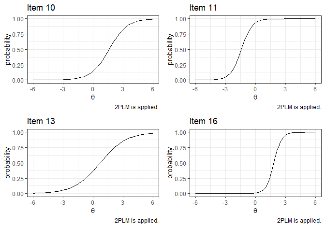

<!-- README.md is generated from README.Rmd. Please edit that file -->

# Welcome to **IRTest**!

*Please feel free to* [create an
issue](https://github.com/SeewooLi/IRTest/issues) *for bug reports or
potential improvements.*

<!-- badges: start -->

[](https://github.com/SeewooLi/IRTest/actions/workflows/R-CMD-check.yaml)
[](https://CRAN.R-project.org/package=IRTest)
[](https://cranlogs.r-pkg.org/badges/grand-total/IRTest)
[](https://app.codecov.io/gh/SeewooLi/IRTest)
<!-- badges: end -->

**IRTest** is a useful tool for $\mathcal{\color{red}{IRT}}$ (item
response theory) parameter $\mathcal{\color{red}{est}}\text{imation}$,
especially when the violation of normality assumption on latent
distribution is suspected.  
**IRTest** deals with uni-dimensional latent variable.  
In **IRTest**, including the conventional usage of Gaussian
distribution, several methods can be applied for estimation of latent
distribution:  
+ empirical histogram method,  
+ two-component Gaussian mixture distribution,  
+ Davidian curve,  
+ kernel density estimation.

## Installation

The CRAN version of **IRTest** can be installed on R-console with:

``` r
install.packages("IRTest")
```

For the development version, it can be installed on R-console with:

``` r
devtools::install_github("SeewooLi/IRTest")
```

## Functions

Followings are functions of **IRTest**.

- `IRTest_Dich` is the estimation function when all items are
  *dichotomously* scored.

- `IRTest_Poly` is the estimation function when all items are
  *polytomously* scored.

- `IRTest_Mix` is the estimation function for *a mixed-format test*, a
  test comprising both dichotomous item(s) and polytomous item(s).

- `item_fit` tests the statistical fit of all items individually.

- `plot_item` draws item response function(s) of an item.

- `DataGeneration` generates several objects that can be useful for
  computer simulation studies. Among these are starting values for the
  estimation algorithm and artificial item-response data that can be
  passed into `IRTest_Dich`, `IRTest_Poly`, or `IRTest_Mix`.

- `dist2` is a probability density function of two-component Gaussian
  mixture distribution.

- `original_par_2GM` converts re-parameterized parameters of
  two-component Gaussian mixture distribution into original parameters.

## Example

A simple simulation study for a GPCM model can be done in following
manners:

``` r
library(IRTest)
```

- Data generation

An artificial data of 1000 examinees and 20 items.

``` r
Alldata <- DataGeneration(seed = 1234,
                          model_D = rep(2,20),
                          N=1000,
                          nitem_D = 20,
                          latent_dist = "2NM",
                          m=0,
                          s=1,
                          d = 1.664,
                          sd_ratio = 2,
                          prob = 0.3)

data <- Alldata$data_D
item <- Alldata$item_D
theta <- Alldata$theta
```

- Analysis

For an illustrative purpose, kernel density estimation (KDE) method is
used for the estimation of latent distribution.

``` r
Mod1 <- IRTest_Dich(data = data,
                    model = "2PL",
                    latent_dist = "KDE",
                    threshold = .001
                    )
```

- Summary of the result

``` r
summary(Mod1)
#> Convergence:  
#> Successfully converged below the threshold of 0.001 on 11st iterations. 
#> 
#> Model Fit:  
#>    deviance   18382.98 
#>         AIC   18464.98 
#>         BIC   18666.2 
#> 
#> The Number of Parameters:  
#>        item   40 
#>        dist   1 
#>       total   41 
#> 
#> The Number of Items:  
#> dichotomous   20 
#> polyotomous   0 
#> 
#> The Estimated Latent Distribution:  
#> method - KDE 
#> ----------------------------------------
#>                                           
#>                                           
#>                                           
#>                       @ @ @               
#>                   . @ @ @ @ @             
#>         . @ @ . @ @ @ @ @ @ @ @           
#>       . @ @ @ @ @ @ @ @ @ @ @ @ .         
#>     . @ @ @ @ @ @ @ @ @ @ @ @ @ @ .       
#>   . @ @ @ @ @ @ @ @ @ @ @ @ @ @ @ @ .     
#> . @ @ @ @ @ @ @ @ @ @ @ @ @ @ @ @ @ @ @ . 
#> +---------+---------+---------+---------+
#> -2        -1        0         1         2
```

- Parameter estimation results

``` r
colnames(item) <- c("a", "b", "c")

knitr::kables(
  list(
    ### True item parameters 
    knitr::kable(item, format='simple', caption = "True item parameters", digits = 2)%>%
  kableExtra::kable_styling(font_size = 4),

    ### Estimated item parameters
    knitr::kable(Mod1$par_est, format='simple', caption = "Estimated item parameters", digits = 2)%>%
  kableExtra::kable_styling(font_size = 4)
  )
)
```

<table class="kable_wrapper">
<tbody>
<tr>
<td>

|    a |     b |   c |
|-----:|------:|----:|
| 1.62 | -0.30 |   0 |
| 1.22 | -1.00 |   0 |
| 1.73 | -0.90 |   0 |
| 1.36 | -0.68 |   0 |
| 2.19 | -0.14 |   0 |
| 1.17 | -1.03 |   0 |
| 1.80 | -0.52 |   0 |
| 1.90 |  1.25 |   0 |
| 1.06 |  1.71 |   0 |
| 0.90 |  1.81 |   0 |
| 2.12 | -1.39 |   0 |
| 2.23 | -0.02 |   0 |
| 0.87 |  0.62 |   0 |
| 2.35 | -0.06 |   0 |
| 1.50 | -1.08 |   0 |
| 2.39 |  1.88 |   0 |
| 2.25 | -0.64 |   0 |
| 2.25 |  1.78 |   0 |
| 1.10 |  1.03 |   0 |
| 1.65 | -0.70 |   0 |

True item parameters

</td>
<td>

|    a |     b |   c |
|-----:|------:|----:|
| 1.47 | -0.28 |   0 |
| 1.22 | -0.97 |   0 |
| 1.77 | -0.84 |   0 |
| 1.41 | -0.59 |   0 |
| 1.81 | -0.16 |   0 |
| 1.20 | -1.00 |   0 |
| 1.99 | -0.49 |   0 |
| 1.87 |  1.41 |   0 |
| 1.14 |  1.51 |   0 |
| 1.05 |  1.68 |   0 |
| 1.85 | -1.46 |   0 |
| 2.20 | -0.05 |   0 |
| 0.75 |  0.72 |   0 |
| 2.19 | -0.01 |   0 |
| 1.54 | -1.10 |   0 |
| 2.25 |  1.99 |   0 |
| 2.17 | -0.69 |   0 |
| 2.40 |  1.77 |   0 |
| 1.18 |  0.94 |   0 |
| 1.90 | -0.71 |   0 |

Estimated item parameters

</td>
</tr>
</tbody>
</table>

``` r


### Plotting
par(mfrow=c(1,2))
plot(item[,2], Mod1$par_est[,2], xlab = "true", ylab = "estimated", main = "item parameters")
abline(a=0,b=1)
plot(theta, Mod1$theta, xlab = "true", ylab = "estimated", main = "ability parameters")
abline(a=0,b=1)
```


- The result of latent distribution estimation

``` r
plot(Mod1, mapping = aes(colour="Estimated"), linewidth = 1) +
  lims(
    y = c(0, .75)
  )+
  geom_line(
    mapping=aes(
      x=seq(-6,6,length=121), 
      y=dist2(
        seq(-6,6,length=121),
        prob = .3, 
        d=1.664, 
        sd_ratio = 2
        ), 
      colour="True"),
    linewidth = 1)+
  labs(
    title="The estimated latent density using 'EHM'", colour= "Type"
    )+
  theme_bw()
```


- Posterior distributions for the examinees

Each examinee’s posterior distribution is identified in the E-step of
the estimation algorithm (i.e., EM algorithm). Posterior distributions
can be found in `Mod1$Pk`.

``` r
set.seed(1)
selected_examinees <- sample(1:1000,6)
post_sample <- 
  data.frame(
    X = rep(seq(-6,6, length.out=121),6), 
    prior = rep(Mod1$Ak/(Mod1$quad[2]-Mod1$quad[1]), 6),
    posterior = 10*c(t(Mod1$Pk[selected_examinees,])), 
    ID = rep(paste("examinee", selected_examinees), each=121)
    )

ggplot(data=post_sample, mapping=aes(x=X))+
  geom_line(mapping=aes(y=posterior, group=ID, color='Posterior'))+
  geom_line(mapping=aes(y=prior, group=ID, color='Prior'))+
  labs(title="Posterior densities for selected examinees", x=expression(theta), y='density')+
  facet_wrap(~ID, ncol=2)+
  theme_bw()
```


- Item fit

``` r
item_fit(Mod1)
#>         stat df p.value
#> 1  13.469663  7  0.0615
#> 2   8.541813  7  0.2872
#> 3  19.524974  7  0.0067
#> 4   7.045802  7  0.4241
#> 5  10.720393  7  0.1513
#> 6  13.874404  7  0.0535
#> 7   4.784380  7  0.6863
#> 8  14.962374  7  0.0365
#> 9   9.451649  7  0.2218
#> 10 16.720180  7  0.0193
#> 11  6.249525  7  0.5109
#> 12  9.739056  7  0.2038
#> 13  7.305287  7  0.3978
#> 14 26.481248  7  0.0004
#> 15 18.232721  7  0.0110
#> 16 17.149747  7  0.0165
#> 17  9.989355  7  0.1892
#> 18 38.244264  7  0.0000
#> 19 19.537622  7  0.0067
#> 20 11.457360  7  0.1199
```

- Item response function

``` r
# Item response function of Item 1
plot_item(Mod1,1)
```


