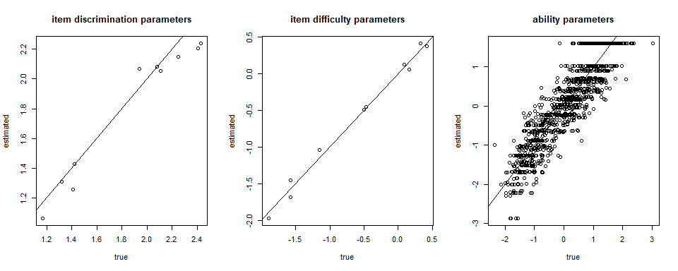
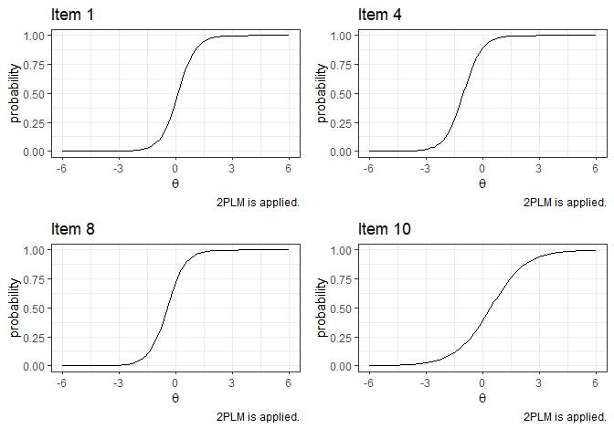
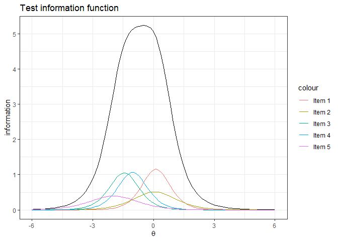

<!-- README.md is generated from README.Rmd. Please edit that file -->

# Welcome to **IRTest**!

*Please feel free to* [create an
issue](https://github.com/SeewooLi/IRTest/issues) *for bug reports or
potential improvements.*

<!-- badges: start -->

[](https://github.com/SeewooLi/IRTest/actions/workflows/R-CMD-check.yaml)
[](https://CRAN.R-project.org/package=IRTest)
[](https://cranlogs.r-pkg.org/badges/grand-total/IRTest)
[](https://app.codecov.io/gh/SeewooLi/IRTest)
<!-- badges: end -->

**IRTest** is a useful tool for $\mathcal{\color{red}{IRT}}$ (item
response theory) parameter $\mathcal{\color{red}{est}}\text{imation}$,
especially when the violation of normality assumption on latent
distribution is suspected.  
**IRTest** deals with uni-dimensional latent variable.  
In **IRTest**, including the conventional usage of Gaussian
distribution, several methods can be applied for estimation of latent
distribution:  
+ empirical histogram method,  
+ two-component Gaussian mixture distribution,  
+ Davidian curve,  
+ kernel density estimation,  
+ log-linear smoothing.

## Installation

The CRAN version of **IRTest** can be installed on R-console with:

    install.packages("IRTest")

For the development version, it can be installed on R-console with:

    devtools::install_github("SeewooLi/IRTest")

## Functions

Followings are the functions of **IRTest**.

- `IRTest_Dich` is the estimation function when all items are
  *dichotomously* scored.

- `IRTest_Poly` is the estimation function when all items are
  *polytomously* scored.

- `IRTest_Mix` is the estimation function for *a mixed-format test*, a
  test comprising both dichotomous item(s) and polytomous item(s).

- `item_fit` tests the statistical fit of all items individually.

- `inform_f_item` calculates the information value(s) of an item.

- `inform_f_test` calculates the information value(s) of a test.

- `plot_item` draws item response function(s) of an item.

- `reliability` calculates marginal reliability coefficient of IRT.

- `DataGeneration` generates several objects that can be useful for
  computer simulation studies. Among these are simulated item
  parameters, ability parameters and the corresponding item-response
  data.

- `dist2` is a probability density function of two-component Gaussian
  mixture distribution.

- `original_par_2GM` converts re-parameterized parameters of
  two-component Gaussian mixture distribution into original parameters.

- `cat_clps` recommends category collapsing based on item parameters
  (or, equivalently, item response functions).

- `recategorize` implements the category collapsing.

## Example

A simple simulation study for a 2PL model can be done in following
manners:

``` r
library(IRTest)
```

- Data generation

An artificial data of 1000 examinees and 20 items.

``` r
Alldata <- DataGeneration(seed = 1234,
                          model_D = rep(2,20),
                          N=1000,
                          nitem_D = 20,
                          latent_dist = "2NM",
                          m=0,
                          s=1,
                          d = 1.664,
                          sd_ratio = 2,
                          prob = 0.3)

data <- Alldata$data_D
item <- Alldata$item_D
theta <- Alldata$theta
```

- Analysis

For an illustrative purpose, kernel density estimation (KDE) method is
used for the estimation of latent distribution.

``` r
Mod1 <- 
  IRTest_Dich(
    data = data,
    latent_dist = "KDE"
    )
```

- Summary of the result

``` r
summary(Mod1)
#> Convergence:  
#> Successfully converged below the threshold of 1e-04 on 23rd iterations. 
#> 
#> Model Fit:  
#>    deviance   18383.84 
#>         AIC   18465.84 
#>         BIC   18667.05 
#> 
#> The Number of Parameters:  
#>        item   40 
#>        dist   1 
#>       total   41 
#> 
#> The Number of Items:  
#> dichotomous   20 
#> polyotomous   0 
#> 
#> The Estimated Latent Distribution:  
#> method - KDE 
#> ----------------------------------------
#>                                           
#>                                           
#>                                           
#>                       @ @ @               
#>                   . @ @ @ @ @             
#>         . @ @ @ @ @ @ @ @ @ @ @           
#>       . @ @ @ @ @ @ @ @ @ @ @ @ @         
#>     . @ @ @ @ @ @ @ @ @ @ @ @ @ @ .       
#>   . @ @ @ @ @ @ @ @ @ @ @ @ @ @ @ @ .     
#> . @ @ @ @ @ @ @ @ @ @ @ @ @ @ @ @ @ @ @ . 
#> +---------+---------+---------+---------+
#> -2        -1        0         1         2
```

- Parameter estimation results

``` r
colnames(item) <- c("a", "b", "c")

knitr::kables(
  list(
    ### True item parameters 
    knitr::kable(item, format='simple', caption = "True item parameters", digits = 2)%>%
  kableExtra::kable_styling(font_size = 4),

    ### Estimated item parameters
    knitr::kable(Mod1$par_est, format='simple', caption = "Estimated item parameters", digits = 2)%>%
  kableExtra::kable_styling(font_size = 4)
  )
)
```

<table class="kable_wrapper">
<tbody>
<tr>
<td>

|    a |     b |   c |
|-----:|------:|----:|
| 1.62 | -0.30 |   0 |
| 1.22 | -1.00 |   0 |
| 1.73 | -0.90 |   0 |
| 1.36 | -0.68 |   0 |
| 2.19 | -0.14 |   0 |
| 1.17 | -1.03 |   0 |
| 1.80 | -0.52 |   0 |
| 1.90 |  1.25 |   0 |
| 1.06 |  1.71 |   0 |
| 0.90 |  1.81 |   0 |
| 2.12 | -1.39 |   0 |
| 2.23 | -0.02 |   0 |
| 0.87 |  0.62 |   0 |
| 2.35 | -0.06 |   0 |
| 1.50 | -1.08 |   0 |
| 2.39 |  1.88 |   0 |
| 2.25 | -0.64 |   0 |
| 2.25 |  1.78 |   0 |
| 1.10 |  1.03 |   0 |
| 1.65 | -0.70 |   0 |

True item parameters

</td>
<td>

|    a |     b |   c |
|-----:|------:|----:|
| 1.47 | -0.28 |   0 |
| 1.22 | -0.97 |   0 |
| 1.77 | -0.84 |   0 |
| 1.41 | -0.58 |   0 |
| 1.81 | -0.15 |   0 |
| 1.19 | -0.99 |   0 |
| 1.98 | -0.48 |   0 |
| 1.88 |  1.41 |   0 |
| 1.14 |  1.51 |   0 |
| 1.05 |  1.68 |   0 |
| 1.84 | -1.46 |   0 |
| 2.20 | -0.05 |   0 |
| 0.75 |  0.73 |   0 |
| 2.19 | -0.01 |   0 |
| 1.54 | -1.10 |   0 |
| 2.29 |  1.98 |   0 |
| 2.16 | -0.68 |   0 |
| 2.44 |  1.76 |   0 |
| 1.18 |  0.94 |   0 |
| 1.90 | -0.71 |   0 |

Estimated item parameters

</td>
</tr>
</tbody>
</table>

``` r


### Plotting
par(mfrow=c(1,3))
plot(item[,1], Mod1$par_est[,1], xlab = "true", ylab = "estimated", main = "item discrimination parameters")
abline(a=0,b=1)
plot(item[,2], Mod1$par_est[,2], xlab = "true", ylab = "estimated", main = "item difficulty parameters")
abline(a=0,b=1)
plot(theta, Mod1$theta, xlab = "true", ylab = "estimated", main = "ability parameters")
abline(a=0,b=1)
```



- The result of latent distribution estimation

``` r
plot(Mod1, mapping = aes(colour="Estimated"), linewidth = 1) +
  lims(
    y = c(0, .75)
  )+
  geom_line(
    mapping=aes(
      x=seq(-6,6,length=121), 
      y=dist2(
        seq(-6,6,length=121),
        prob = .3, 
        d=1.664, 
        sd_ratio = 2
        ), 
      colour="True"),
    linewidth = 1)+
  labs(
    title="The estimated latent density using 'EHM'", colour= "Type"
    )+
  theme_bw()
```


- Posterior distributions for the examinees

Each examinee’s posterior distribution is identified in the E-step of
the estimation algorithm (i.e., EM algorithm). Posterior distributions
can be found in `Mod1$Pk`.

``` r
set.seed(1)
selected_examinees <- sample(1:1000,6)
post_sample <- 
  data.frame(
    X = rep(seq(-6,6, length.out=121),6), 
    prior = rep(Mod1$Ak/(Mod1$quad[2]-Mod1$quad[1]), 6),
    posterior = 10*c(t(Mod1$Pk[selected_examinees,])), 
    ID = rep(paste("examinee", selected_examinees), each=121)
    )

ggplot(data=post_sample, mapping=aes(x=X))+
  geom_line(mapping=aes(y=posterior, group=ID, color='Posterior'))+
  geom_line(mapping=aes(y=prior, group=ID, color='Prior'))+
  labs(title="Posterior densities for selected examinees", x=expression(theta), y='density')+
  facet_wrap(~ID, ncol=2)+
  theme_bw()
```


- Item fit

``` r
item_fit(Mod1)
#>         stat df p.value
#> 1  13.047984  7  0.0709
#> 2   8.733441  7  0.2724
#> 3  19.383423  7  0.0071
#> 4   6.878263  7  0.4417
#> 5  11.073217  7  0.1355
#> 6  13.956565  7  0.0520
#> 7   4.423842  7  0.7299
#> 8  14.847199  7  0.0380
#> 9   9.801792  7  0.2001
#> 10 18.212654  7  0.0110
#> 11  6.074096  7  0.5311
#> 12  9.842054  7  0.1977
#> 13  7.715410  7  0.3584
#> 14 26.761115  7  0.0004
#> 15 18.045903  7  0.0118
#> 16 17.342742  7  0.0153
#> 17  9.696964  7  0.2064
#> 18 41.352840  7  0.0000
#> 19 19.068656  7  0.0080
#> 20 11.382014  7  0.1228
```

- Item response function

``` r
# Item response function of Item 1
p1 <- plot_item(Mod1,10)
p2 <- plot_item(Mod1,11)
p3 <- plot_item(Mod1,13)
p4 <- plot_item(Mod1,16)
grid.arrange(p1, p2, p3, p4, ncol=2, nrow=2)
```



- Reliability

``` r
reliability(Mod1)
#> $rel.summed.score.test
#> test reliability 
#>        0.8798594 
#> 
#> $rel.summed.score.item
#>         1         2         3         4         5         6         7         8 
#> 0.3059621 0.2192103 0.3503349 0.2841813 0.3877848 0.2114709 0.4183149 0.2753318 
#>         9        10        11        12        13        14        15        16 
#> 0.1577073 0.1344473 0.2829392 0.4631938 0.1094399 0.4606663 0.2779550 0.2363950 
#>        17        18        19        20 
#> 0.4400902 0.2898488 0.1994503 0.3873396
```

- Test information function

``` r
ggplot()+
  stat_function(
    fun = inform_f_test,
    args = list(Mod1)
  )+
  lims(x=c(-6,6))+
  labs(title="Test information function", x=expression(theta), y='information')+
  theme_bw()
```


