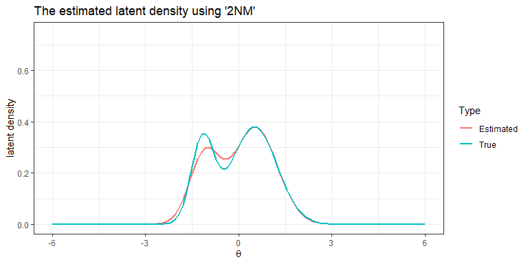
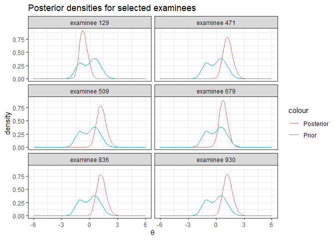

<!-- README.md is generated from README.Rmd. Please edit that file -->

# IRTest

<!-- badges: start -->

[](https://github.com/SeewooLi/IRTest/actions/workflows/R-CMD-check.yaml)
[](https://CRAN.R-project.org/package=IRTest)
<!-- badges: end -->

**IRTest** can be a useful tool for IRT (item response theory) parameter
estimation, especially when the violation of normality assumption on
latent distribution is suspected.  
**IRTest** deals with uni-dimensional latent variable.  
In **IRTest**, along with the conventional approach that assumes
normality on latent distribution, several methods can be applied for
estimation of latent distribution:  
+ empirical histogram method,  
+ two-component Gaussian mixture distribution,  
+ Davidian curve,  
+ kernel density estimation.

## Installation

You can install **IRTest** on R-console with:

``` r
install.packages("IRTest")
```

## Functions

Followings are functions of **IRTest** available for users.

-   `IRTest_Dich` is the estimation function when all items are
    dichotomously scored.

-   `IRTest_Poly` is the estimation function when all items are
    polytomously scored.

-   `IRTest_Mix` is the estimation function for a mixed-format test, a
    combination of dichotomous item(s) and polytomous item(s).

-   `DataGeneration` generates several objects that are useful for
    computer simulation studies. Among these are starting values for an
    algorithm and artificial item-response data that can be passed to
    `IRTest_Dich`, `IRTest_Poly`, or `IRTest_Mix`

-   `plot_LD` draws a plot of the estimated latent distribution.

-   `dist2` is a probability density function of two-component Gaussian
    mixture distribution.

-   `original_par_2GM` converts re-parameterized parameters of
    two-component Gaussian mixture distribution into original
    parameters.

## Example

A simulation study for a Rasch model can be done in following manners:

``` r
library(IRTest)
```

-   An artificial data of 1000 examinees and 20 items.

``` r
Alldata <- DataGeneration(seed = 123456789,
                          model_D = rep(1, 20),
                          N=1000,
                          nitem_D = 20,
                          nitem_P = 0,
                          d = 1.664,
                          sd_ratio = 2,
                          prob = 0.3)

data <- Alldata$data_D
item <- Alldata$item_D
initialitem <- Alldata$initialitem_D
theta <- Alldata$theta
```

-   Analysis

For an illustrative purpose, empirical histogram method is used for the
estimation of latent distribution.

``` r
Mod1 <- IRTest_Dich(initialitem = initialitem,
                    data = data,
                    model = rep("1PL", 20),
                    latent_dist = "EHM",
                    max_iter = 200,
                    threshold = .001
                    )
```

-   Parameter estimation results

``` r
### True item parameters 
item
#>       [,1]  [,2] [,3]
#>  [1,]    1 -0.96    0
#>  [2,]    1  1.04    0
#>  [3,]    1  0.47    0
#>  [4,]    1 -0.16    0
#>  [5,]    1 -0.81    0
#>  [6,]    1 -0.40    0
#>  [7,]    1  0.82    0
#>  [8,]    1 -0.37    0
#>  [9,]    1 -1.11    0
#> [10,]    1  0.50    0
#> [11,]    1 -0.97    0
#> [12,]    1 -1.05    0
#> [13,]    1  0.02    0
#> [14,]    1  1.32    0
#> [15,]    1 -0.50    0
#> [16,]    1  0.18    0
#> [17,]    1 -1.39    0
#> [18,]    1  0.59    0
#> [19,]    1 -0.58    0
#> [20,]    1 -1.59    0

### Estimated item parameters
Mod1$par_est
#>       a           b c
#>  [1,] 1 -0.81778940 0
#>  [2,] 1  0.95147161 0
#>  [3,] 1  0.47031687 0
#>  [4,] 1 -0.05744344 0
#>  [5,] 1 -0.85035950 0
#>  [6,] 1 -0.43165890 0
#>  [7,] 1  0.88522005 0
#>  [8,] 1 -0.31579314 0
#>  [9,] 1 -1.16806277 0
#> [10,] 1  0.53663630 0
#> [11,] 1 -1.07440478 0
#> [12,] 1 -1.16213006 0
#> [13,] 1  0.07098615 0
#> [14,] 1  1.25366401 0
#> [15,] 1 -0.42659144 0
#> [16,] 1  0.20463597 0
#> [17,] 1 -1.37707762 0
#> [18,] 1  0.59841164 0
#> [19,] 1 -0.75333017 0
#> [20,] 1 -1.69652969 0

### Plotting
par(mfrow=c(1,2))
plot(item[,2], Mod1$par_est[,2], xlab = "true", ylab = "estimated", main = "item parameters")
abline(a=0,b=1)
plot(theta, Mod1$theta, xlab = "true", ylab = "estimated", main = "ability parameters")
abline(a=0,b=1)
```


-   Result of latent distribution estimation

``` r
plot_LD(Mod1)+
  geom_line(mapping = aes(colour="Estimated"))+
  geom_line(mapping=aes(x=seq(-6,6,length=121), 
                        y=dist2(seq(-6,6,length=121),prob = .3, d=1.664, sd_ratio = 2), 
                        colour="True"))+
  labs(title="The estimated latent density using 'EHM'", colour= "Type")+
  theme_bw()
```



-   Posterior distribution for examinees

``` r
set.seed(1)
selected_examinees <- sample(1:1000,6)
post_sample <- data.frame(X=rep(seq(-6,6, length.out=121),6), 
                          posterior = 10*c(t(Mod1$Pk[selected_examinees,])), 
                          ID=rep(paste("examinee", selected_examinees), each=121))
ggplot(data=post_sample, mapping=aes(x=X, y=posterior, group=ID))+
  geom_line()+
  labs(title="Posterior density for selected examinees", x=expression(theta))+
  facet_wrap(~ID, ncol=2)+
  annotate(geom="line", x=seq(-6,6,length=121), 
                        y=dist2(seq(-6,6,length=121),prob = .3, d=1.664, sd_ratio = 2), colour="grey")+
  theme_bw()
```


